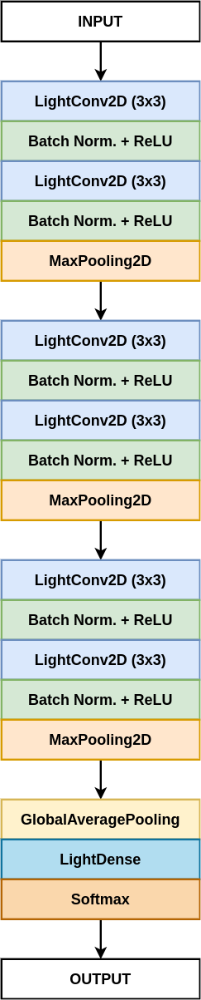

## LightLayers: Parameter Efficient Dense andConvolutional Layers for Image Classification

Deep Neural Networks (DNNs) have become the de-facto standard in computer vision, as well as in many other pattern recognition tasks. A key drawback of DNNs is that the training phase can be very computationally expensive. Organizations or individuals that cannot afford purchasing state-of-the-art hardware or tapping into cloud hosted infrastructures may face a long  waiting time before the training completes or might not be able to train a model at all.  Investigating novel ways to reduce the training time could be a potential solution to alleviate this drawback, and thus enabling more rapid development of new algorithms and models. 
In this paper, we propose LightLayers: a method for reducing the number of trainable parameters in deep neural networks (DNN). The proposed LightLayers consists of LightDense and LightConv2D layer that are efficient as compared to regular Conv2D and Dense layer but uses less parameters. We resort to Matrix Factorization to reduce the complexity of the DNN models resulting into lightweight DNN models  that require less computational power, without much loss in the accuracy.  We have tested LightLayers on MNIST, Fashion MNIST, CIFAR 10, and CIFAR 100 datasets. Promising results are obtained for MNIST, Fashion MNIST, CIFAR-10 datasets whereas CIFAR 100 shows acceptable performance by using fewer parameters.  

[LightLayers: Parameter Efficient Dense andConvolutional Layers for Image Classification](lightlayers.pdf).

## Architecture

## Datasets:
The following datasets are used in this experiment:
<ol>
  <li>MNIST Database</li>
  <li>Fashion MNIST Database</li>
  <li>CIFAR-10 Database/li>
  <li>CIFAR-100 Database</li>
 </ol>

 ## Results
 

 

## Citation
Please cite our paper if you find the work useful: 
<pre>
  @INPROCEEDINGS{9183321,
  author={D. {Jha} and A {Yazadi} and M. A. {Riegler} and D. {Johansen} and P. {Halvorsen} and H. D. {Johansen}},
  booktitle={PDCAT-PAAP}, 
  title={LightLayers: Parameter Efficient Dense andConvolutional Layers for Image Classification}, 
  year={2020},
</pre>

## Contact
please contact debesh@simula.no for any further questions. 
